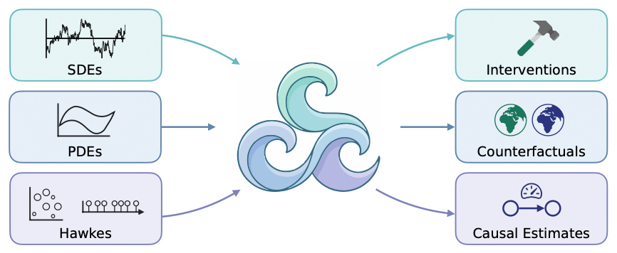

<p align="center">
  
</p>

# C3: Resolution-Invariant Causal Modeling in Continuous Space-Time

This repository contains the implementation accompanying the paper **"Resolution-Invariant Causal Modeling in Continuous Space-Time"**.

## Overview

The main implementation is collected in [main.ipynb](main.ipynb). The notebook contains the experiments and visualizations for the different continuous space-time settings used in the paper, including temporal point processes, ODE-based examples, Brownian motion, spatio-temporal point processes, and the forest-conflict model.

Everything in this project can be run in **Google Colab**. The main entry point is:

[Open `main.ipynb` in Colab](https://colab.research.google.com/github/DSanonym/c3/blob/main/main.ipynb)

## Forest-Conflict Model

The forest-conflict model is also included as a separate standalone script:

- [forest_conflict_exp_standalone.py](forest_conflict_exp_standalone.py)

This experiment can still be run in Colab, but it is provided as a standalone Python script because it takes a bit longer to run than the other examples.

## Running the Standalone Script with `uv`

One simple way to run the forest-conflict experiment locally is with a `uv` virtual environment:

```bash
uv venv
source .venv/bin/activate
uv pip install numpy pandas matplotlib seaborn scipy tqdm
python forest_conflict_exp_standalone.py
```

The script writes its generated outputs to the `ForestConflict/` directory when run locally.

## Paper

The paper PDF is included directly in this repository:

- `06.05.2026..C3_Resolution_Invariant_Causal_Modeling_in_Continuous_Space-Time.pdf`
